# Digital Money House - Backend

Este repositorio contiene el backend del proyecto **Digital Money House**, desarrollado como proyecto final para **Digital House**. Se trata de una **billetera virtual** construida con **Spring Boot** bajo una arquitectura de **microservicios**, que permite a los usuarios gestionar cuentas, tarjetas, autenticarse y realizar operaciones financieras.

## ✨ Características del Proyecto

* Arquitectura basada en microservicios
* Enrutamiento mediante API Gateway
* Registro y descubrimiento de servicios con Eureka
* Configuración centralizada con Spring Cloud Config
* Redis para gestión de sesiones (tokens JWT invalidados)
* Base de datos SQLite para persistencia ligera
* Testing funcional con planillas manuales (.xlsx)

## 📅 Microservicios

* `auth-server`: Autenticación y generación de JWT
* `users-server`: Registro y actualización de usuarios
* `accounts-server`: Gestión de cuentas (CVU, alias, saldos)
* `cards-server`: Gestión de tarjetas (altas, bajas, asociación con usuarios)
* `activities-server`: Registro de actividades (transferencias, ingresos, movimientos)
* `eureka-server`: Registro de servicios
* `config-server`: Configuración centralizada
* `gateway`: Enrutamiento de peticiones

## 🚀 Requisitos

* Java 21
* Git
* SQLite 3 o DB Browser for SQLite (opcional para revisar `money-dh.db`)

> ⚠️ No es necesario tener Maven instalado globalmente: el proyecto incluye **Maven Wrapper** (`mvnw` y `mvnw.cmd`).

## ⚒️ Compilación y Estructura del Proyecto

Para compilar el proyecto desde la raíz del repositorio:

```bash
./mvnw clean install
```

O si estás en Windows:

```bash
mvnw.cmd clean install
```

Estructura del repositorio:

```
DMHBackend/
├── backend/
│   ├── accounts-server/
│   ├── activities-server/
│   ├── auth-server/
│   ├── cards-server/
│   ├── config-server/
│   ├── eureka-server/
│   ├── gateway/
│   └── users-server/
├── .mvn/
├── mvnw
├── mvnw.cmd
├── data/
│   └── money-dh.db
├── README.md
```

## 🌐 Tecnologías Utilizadas

* **Java 21**, **Spring Boot 3**, **Spring Cloud 2023.0.1**
* **SQLite** como base de datos ligera local
* **Redis** (con Docker) para almacenamiento temporal
* **Maven** (wrapper incluido)
* **Feign**, **Spring Config**, **Eureka**, **Gateway**
* **DB Browser for SQLite** (recomendado para editar/ver `money-dh.db`)

## 🔹 Testing Manual

El proyecto incluye un archivo `Testing_manual.xlsx` en el que se describen pruebas manuales realizadas durante el Sprint 1 y siguientes. Se incluyen pasos, resultados esperados, datos de prueba ficticios y observaciones.

## 🏛️ Arquitectura Visual

A continuación se presenta una representación gráfica de la arquitectura del sistema en formato Mermaid, ideal para visualizar rápidamente los componentes y su interacción:

```mermaid
graph TD
    subgraph "Infraestructura Central"
        ConfigServer["Servidor de Configuración (Spring Cloud Config)"]
        EurekaServer["Registro de Servicios (Eureka)"]
    end

    subgraph "Servicios de Negocio"
        AuthService["Servicio de Autenticación"]
        UserService["Servicio de Usuarios"]
        AccountService["Servicio de Cuentas"]
        CardService["Servicio de Tarjetas"]
        ActivityService["Servicio de Actividades"]
    end

    subgraph "Capa de Exposición y Caché"
        APIGateway["API Gateway (Spring Cloud Gateway)"]
        RedisCache["Caché / Sesiones (Redis)"]
    end
    
    ClientApp["Aplicación Cliente"] --> APIGateway

    APIGateway -->|Enruta peticiones a| AuthService
    APIGateway -->|Enruta peticiones a| UserService
    APIGateway -->|Enruta peticiones a| AccountService
    APIGateway -->|Enruta peticiones a| CardService
    APIGateway -->|Enruta peticiones a| ActivityService

    APIGateway ---|Usa para caché/sesiones| RedisCache

    %% Conexiones con el Registro de Servicios
    style EurekaServer fill:#a2de96
    APIGateway -->|Descubre servicios| EurekaServer
    AuthService -->|Se registra en| EurekaServer
    UserService -->|Se registra en| EurekaServer
    AccountService -->|Se registra en| EurekaServer
    CardService -->|Se registra en| EurekaServer
    ActivityService -->|Se registra en| EurekaServer

    %% Conexiones con el Servidor de Configuración
    style ConfigServer fill:#f9d56e
    APIGateway -->|Obtiene configuración de| ConfigServer
    RedisCache -->|Obtiene configuración de| ConfigServer
    AuthService -->|Obtiene configuración de| ConfigServer
    UserService -->|Obtiene configuración de| ConfigServer
    AccountService -->|Obtiene configuración de| ConfigServer
    CardService -->|Obtiene configuración de| ConfigServer
    ActivityService -->|Obtiene configuración de| ConfigServer
```



## ✍️

Este proyecto fue desarrollado como trabajo final para la certificación de Backend - Digital House.
